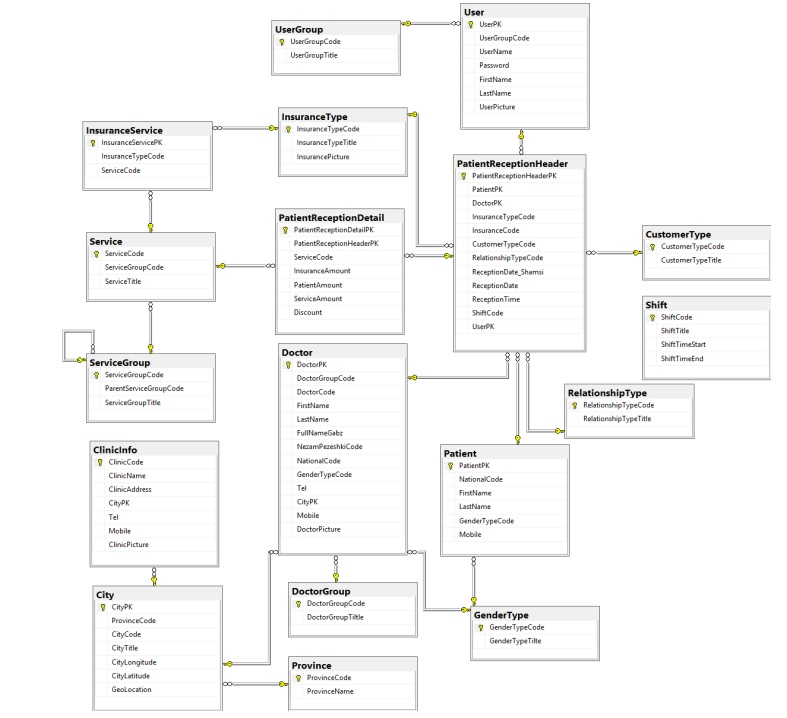
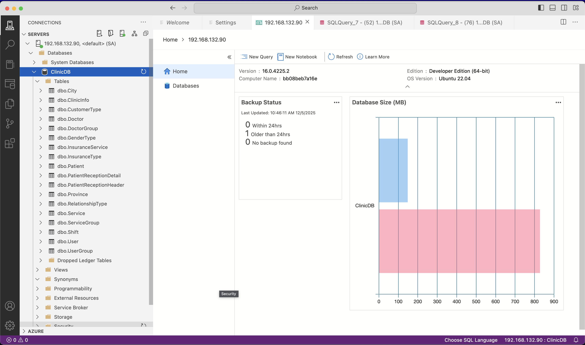
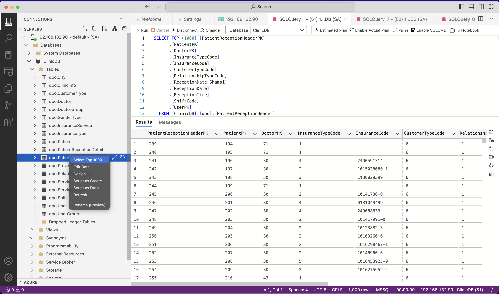
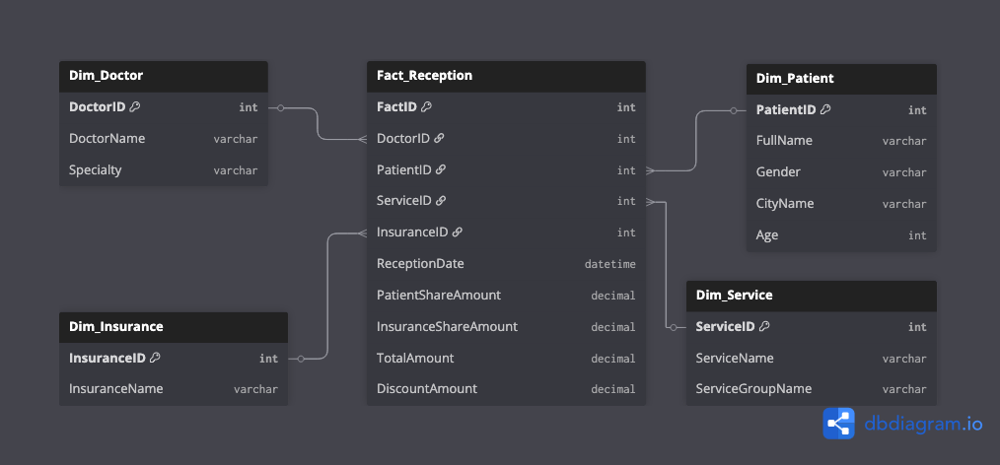
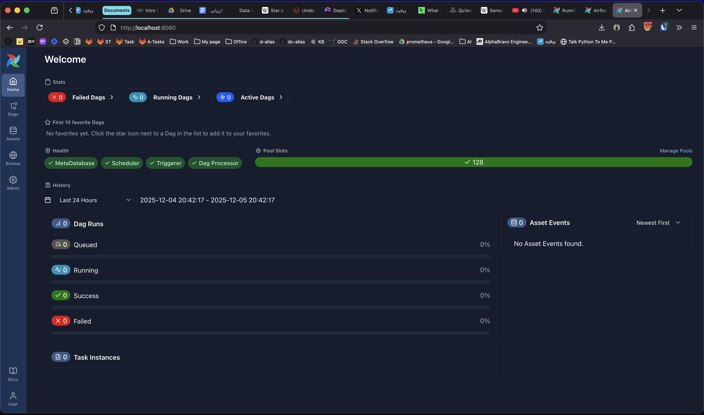
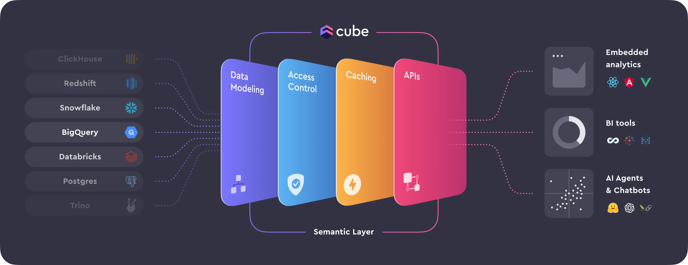
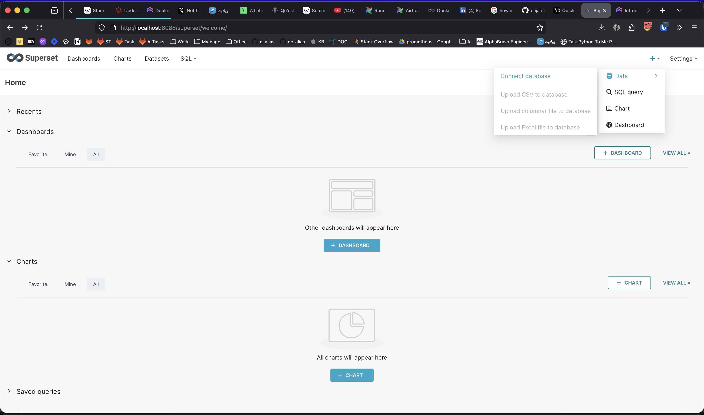

در این داکیومنت مسیری که برای پیاده سازی پروژه `Clinic` پیش بردیم رو توضیح میدیم.

# هدف پروژه
قبل از شروع هرچیزی باید متوجه بشیم دقیقا هدف از انجام پروژه چیست، چی ورودی هایی داریم و باید چه خروجی هایی رو آماده کنیم.

پروژه `Clinic` مربوط به ساخت داشبورد مدیریتی برای یک مرکز کلینیک درمانی است.

در این پروژه الزم است ابتدا یک ساختار Warehouse Data بر اساس مدل Fact و Dimension طراحی و پیادهسازی شود. سپس دادههای مربوط به بیماران، پزشکان، خدمات درمان ی و پرداختها در قالب جداول Fact و Dimension بارگذاری گردد. 

پس از آماده‌سازی پایگاه داده، باید یک داشبورد مدیریتی در ابزارهایی مانند BI Power طراحی شود که شاخص های کلیدی عملکرد (KPIs) از جمله تعداد بیماران در بازه‌های زمانی مختلف، میزان درآمد کلینیک، میانگین زمان انتظار بیماران، و عملکرد پزشکان را به صورت تصویری و قابل تحلیل نمایش دهد. 

این داشبورد باید قابلیت فیلترگذاری پویا داشته باشد تا مدیران بتوانند گزارشها را بر اساس تاریخ، پزشک یا نوع خدمت مشاهده کنند.

پروژه اول: طراحی داشبورد براساس دیتای مرکز کلینیک

## نیازمندیها :

- طراحی داشبورد مدیریتی، عملیاتی براساس دیتابیس مشخص شده
- شناسایی شاخصهای کلیدی عملکرد (KPIs) برای کلینیک درمانی مثل تعداد بیماران
- طراحی DataWarehouse براساس مدل Schema Star یا هر مدل که ساختار Dimension , Fact داشته باشد
- پیادهسازی ETL جداول Fact و Dimension درServer SQL و Python یا هر ابزار مشابه.
- استفاده از ابزار BI Power برای ساخت داشبورد

همچنین ما دیتابیس کلینیک رو داریم که ساختار زیر را دارد :



# مرحله صفر
در این مرحله باید اول ساختار دیتابیس و داده هامون رو بررسی کنی که متوجه بشیم با چه دیتایی طرف هستیم و دیتا چقدر درست و چه مقداری نادرست هستند.

## ایجاد دیتابیس 
اولین کار باید بریم سراغ اینکه متوجه بشیم فایلی که برای دیتابیس به ما داده شده چه نوعی هست که بتونیم عملیات restore رو انجام بدهیم:

با دستور `file` در سیستم های `UNIX` میتوانیم متوجه ماهیت فایل بشیم:

```bash
➜ file ClinicDB.bk 
Windows NTbackup archive NT, software (0x1200): Microsoft SQL Server
```

در این قسمت متوجه میشویم که این فایل برای `Microsoft SQL Server` هست. پس باید بریم این محیط رو برای خودمون فراهم کنیم.

> این پروژه بر روی سیستم عامل لینوکس توسعه داده شده است پس روند پیاده سازی بر روی لینوکس توضیح داده میشود

برای نصب ما دو روش داریم:

- [نصب بر روی لینوکس](https://learn.microsoft.com/en-us/sql/linux/quickstart-install-connect-ubuntu?view=sql-server-ver17&tabs=ubuntu2004%2C2025ubuntu2204%2Codbc-ubuntu-1804)
- [نصب بر روی داکر](https://learn.microsoft.com/en-us/sql/linux/quickstart-install-connect-docker?view=sql-server-ver17&tabs=cli&pivots=cs1-bash)

چون میخواهیم آماده سازی محیط پروژمون برای توسعه و استفاده خیلی سریع و در کمترین عملیات انسانی باشد این رو بر روی داکر نصب کنیم.

برای پیاده سازی طبق [داکیومنت](https://learn.microsoft.com/en-us/sql/linux/quickstart-install-connect-docker?view=sql-server-ver17&tabs=cli&pivots=cs1-bash#run-the-container-3) خود ماکروسافت ادامه میدهیم:

```bash
docker run -e "ACCEPT_EULA=Y" -e "MSSQL_SA_PASSWORD=<password>" \
   -p 1433:1433 --name sql1 --hostname sql1 \
   -d \
   mcr.microsoft.com/mssql/server:2022-latest
```

این روش بالا اومدن کانتینر هستش ولی این روش اصلا روش مناسبی برای اجرا نیست چون بهتر است این روند رو داخل فایل `docker-compose.yml` قرار دهیم تا بتونیم دسترسی خیلی بیشتری روی کانتینر مون داشته باشیم.

پس طبق مفهومی که داکیومنت گفته فایل زیر رو آماده میکنیم:

```yml
services:
  mssql:
    image: mcr.microsoft.com/mssql/server:2022-latest
    container_name: clinic-sqlserver
    ports:
      - "1433:1433"
    env_file:
      - .env
    volumes:
      - ./mssql-data:/var/opt/mssql/data
```

از `volume` ها استفاده میکنیم برای اینکه اگر کانتینر ما خاموش و روشن شد و یا حذف شد دیتای ما از دست نرود و داخل پوشه خودمون ذخیره شود. 

> این پوشه حتما باید جزو git ignore ها قرار بگیرد چون این دیتا نباید بر روی گیت قرار داشته باشد.

و با این کامپوز میتونیم به محیط `Microsoft SQL Server` برسیم. 

حالا مرحله بعدی باید تلاش کنیم که فایل `ClinicDB.bk ` بر روی پروژمون قرار دهیم و با یک بش اسکریپت هر سری چک کنیم که این دیتا بر روی دیتابیس قرار گرفته باشد:

```bash
#!/bin/bash

echo "========================================"
echo "Starting SQL Server - please wait..."
echo "========================================"

# Wait until SQL Server is ready
until /opt/mssql-tools18/bin/sqlcmd -S localhost -U SA -P "$SA_PASSWORD" -No -C -Q "SELECT 1" > /dev/null 2>&1
do
  echo "SQL Server is not ready. Waiting 5 seconds..."
  sleep 5
done

echo "Good! SQL Server is now ready."

# Copy backup file to a place we can use it
cp /var/opt/mssql/backup/ClinicDB.bk /tmp/ClinicDB.bk

echo "Starting to restore ClinicDB database..."

# Restore the database (only if it does not exist)
/opt/mssql-tools18/bin/sqlcmd -S localhost -U SA -P "$SA_PASSWORD" -No -C << EOF
IF DB_ID('ClinicDB') IS NULL
BEGIN
    PRINT 'Creating ClinicDB from backup file...'
    RESTORE DATABASE [ClinicDB]
    FROM DISK = '/tmp/ClinicDB.bk'
    WITH REPLACE,
         MOVE 'ClinicDB'     TO '/var/opt/mssql/data/ClinicDB.mdf',
         MOVE 'ClinicDB_log' TO '/var/opt/mssql/data/ClinicDB_log.ldf'
END
ELSE
BEGIN
    PRINT 'ClinicDB already exists. No changes made.'
END
GO
EOF

echo "========================================"
echo "All done! ClinicDB is ready to use."
echo "========================================"
```

این فایل رو آماده میکنیم تا بتونیم بررسی کنیم هر موقع دیتابیس بالا اومد فایل `ClinicDB.bk` رو بر روی `SQL Server` قرار دهد و اگر وجود داشت صرفا چاپ کند که دیتابیس موجود هستش.

> همچنین نکته ای که هستش ما حتما باید از آپشن های `No -C-` استفاده کنیم، چون از SSL استفاده نمیکنیم امکان اتصال به دیتابیس فراهم نمیشود


و این مورد رو داخل فایل داکر کامپوز مون قرار میدهیم:

```yml
services:
  mssql:
    image: mcr.microsoft.com/mssql/server:2022-latest
    container_name: clinic-sqlserver
    ports:
      - "1433:1433"
    env_file:
      - .env
    volumes:
      - ./mssql-data:/var/opt/mssql/data
      - ./docker/ClinicDB.bk:/var/opt/mssql/backup/ClinicDB.bk:ro
      - ./docker/restore-db.sh:/restore-db.sh:ro
    command: >
      sh -c "
        /opt/mssql/bin/sqlservr &
        /restore-db.sh
        wait
      "
```

از `wait` استفاده میکنیم تا زمانی که کار بش اسکریپت مون تموم شد سیستم رو بالا نگه دارد میتونستیم به روش زیر هم انجام دهیم:

```yml
command: >
      sh -c "
        /restore-db.sh &
        /opt/mssql/bin/sqlservr
      "
```

و حالا میتوانیم با دستور `docker compsoe up -d` این کانتینر مون رو بالا بیاریم. 

حالا با دستور `docker compose logs -f` مشاهده میکنیم که دیتابیس هدف به درستی اضافه شده است یا خیر؟

اگر خط زیر رو ببینیم به این منظور هست که عملیات با موفقیت انجام شده است:

```
clinic-sqlserver  | Processed 7776 pages for database 'ClinicDB', file 'ClinicDB' on file 1.
clinic-sqlserver  | Processed 1 pages for database 'ClinicDB', file 'ClinicDB_log' on file 1.
clinic-sqlserver  | RESTORE DATABASE successfully processed 7777 pages in 21.211 seconds (2.864 MB/sec).
clinic-sqlserver  | ========================================
clinic-sqlserver  | All done! ClinicDB is ready to use.
clinic-sqlserver  | ========================================
```

 
حالا میتوانیم با ابزار `Azure Data Studio` به دیتابیس هدف مون وصل بشیم:



و حالا باید جدول هارو یکی یکی بررسی کنیم :



## بررسی جداول

ما چند نوع جدول داریم که هر کدوم یک سری دیتایی به ما میدهند:

- جداول اصلی تراکنش  (Transaction Tables) 
- جداول موجودیت‌ها (Entities/Dimensions)
- جداول پایه و دسته‌بندی (Lookup/Reference Tables)

###  جداول اصلی تراکنش  (Transaction Tables) 

این‌ مورد جدول هایی هستند که اتفاقات روزمره کلینیک را ثبت می‌کنند. 

تمام KPIهای مورد نظرمون مثل درآمد، تعداد بیمار، از اینجا می‌آیند.
#### جدول ‍`PatientReceptionHeader` 

این جدول مربوط به **نسخه پذیرش** هستش.

هر رکورد این جدول یعنی یک بیمار در یک تاریخ مشخص، پیش یک دکتر مشخص پذیرش شده است.

از این فیلد ها میتونیم این جواب هارو پاسخ دهیم:

- فیلد های `ReceptionDate`, `ReceptionTime`: برای تحلیل‌های زمانی (روزانه، ماهانه)
- فیلد `ReceptionDate_Shamsi`: تاریخ شمسی
- فیلد `PatientPK`: چه کسی آمده؟
- فیلد `DoctorPK`: پیش چه کسی رفته؟
- فیلد `ShiftCode`: در چه شیفتی؟

#### جدول `PatientReceptionDetail`
این جدول مربوط به **اقلام پذیرش** هستش.

هر رکورد این جدول یعنی برای آن پذیرش بالا، چه خدماتی انجام شد.

از این فیلد ها میتونیم  **برای محاسبه درآمد** استفاده کنیم:

- فیلد `PatientAmount`: سهم پرداختی بیمار.
- فیلد `InsuranceAmount`: سهم بیمه.
- فیلد `ServiceAmount`: مبلغ کل خدمت.
- فیلد `Discount`: تخفیف.

جمع این مبالغ می‌شود “درآمد کلینیک”.


###  جداول موجودیت‌ها (Entities/Dimensions)

این‌ جدول ها داده‌های تراکنش را توضیح میدهند.

که مربوط هست  چه کسی و یا چه چیزی


- جدول `Doctor` : مشخصات پزشکان. (نام، تخصص، گروه پزشکی).
- جدول `Patient` : مشخصات بیماران (نام، کد ملی، جنسیت، شهر محل سکونت).
- جدول `Service` : لیست خدمات قابل ارائه (نام خدمت، گروه خدمت).
- جدول `InsuranceType` : تامین اجتماعی، خدمات درمانی و …

### جداول پایه و دسته‌بندی (Lookup/Reference Tables)

این‌ جدول ها معمولاً برای گروه‌بندی استفاده می‌شوند.

- جدول `DoctorGroup`: تخصص‌های پزشکی (عمومی، متخصص قلب و …).
- جدول `ServiceGroup`: دسته‌بندی خدمات (ویزیت، پاراکلینیک، جراحی).
- جدول `City`, `Province`: موقعیت جغرافیایی.
- جدول `Shift`: شیفت‌های کاری (صبح، عصر، شب).
- جدول `GenderType`: جنسیت.

## طراحی ساختار Data Warehouse 
ما بعد از اینکه ساختار جداول رو بررسی کردیم قبل از شروع هر چیزی باید ساختار Data Warehouse رو طراحی کنیم ما برای این کار از سایت [dbdiagram](https://dbdiagram.io) استفاده میکنیم. چون میتوانیم از طریق متن دیتابیس مون رو طراحی کنیم حتی میتونه بهمون خروجی های دیتابیسی بدهد ( که ما فعلا نیازی نداریم ).

شاید این سوال براتون پیش بیاد که ما چرا به مفهومی به نام Data Warehouse نیاز داریم ؟ 

درسته که ما دیتابیسی رو داریم که میتونیم به اون دیتایی که میخوایم میرسیم ولی چیزی که این وسط مهم هستش چطوری و چه زمانی رسیدن به اون داده است که مهم هست.
### چرا Data Warehouse
فرض کنید شما مدیر این کلینیک هستید و میخواهید و متوجه بشید **درآمد ما از بیماران قلبی در شهر تهران** چقدر بوده؟ 

اگر بخواهیم این را از روی همان دیتابیس اصلی که اینجا SQL Server Microsoft هستش بگیریم باید:

1. جدول `ReceptionHeader` را پیدا کنیم.
2.  به جدول `Patient` وصل (Join) کنیم.
3.  جدول `Patient` را به `City` وصل کنیم تا ببینیم تهرانی هستند یا نه.
4.  دوباره برگردیم `ReceptionHeader` را به `ReceptionDetail` وصل کنیم تا مبلغ را پیدا کنیم.
5.  دوباره به `Service` وصل کنیم تا ببینیم چه سرویسی بوده...

این کوئری سنگین است و سرور را برای جواب به این کوئری خیلی زمان میبرد مخصوصا وقتی دیتا خیلی زیاد باشه!

ولی **Data Warehouse** یعنی ما یک دیتابیس جدید می‌سازیم که داده‌ها را از قبل تمیز، تخت و آماده کرده‌ایم تا خواندنش کسر ثانیه طول بکشد.

همچنین بعضی وقت ها هست که دیتای ما داخل دیتابیس وجود ندارد و ما باید از اکسل و یا بستر های دیگه ای دیتا رو بخونیم و داخل یک دیتابیس (Data Warehouse) قرار دهیم.

### مدل ستاره ای چیست؟ 
مدل ستاره ای یا Star Schema یک ساختار هست که مانند ستاره هستش که در بخش مرکز وقایع یا Facts هارو قرار میدهیم و دور این مرکز رو با توصیفات یا Dimension پر میکنیم.

این ساختار باعث میشود که تعداد join های ما به حداقل ترین حالت خودش برسد. که معمولا یک join داریم.

#### بخش وقایع یا Facts چیست؟
این جدول مرکز و قلب سیستم ما هستش. داخل این جدول هرچیزی که عدد هست و قابل جمع بستن هستش رپ ما داخل این بخش قرار میدهیم.

- ماهیتش اینه که همیشه در حال افزایش هستش
- همچنین محتواش کلید های خارجی به اطراف ستاره هستش + اعداد و همان KPI ها
- داخل این دیتابیس اتفاقاتی که افتاده است ذخیره میشود

مثلا ویزیت شدن یک Facts هستش. این رکورد در Facts ذخیره میشود.

#### بخش توصیفات یا Dimension چیست؟
در این بخش توصیف ها قرار میگیرد که به ویزیت ها معنای بیشتری میدهند. این بخش همان چیزی هست گه در داشبورد تبدیل به فیلتر میشود بر اساس این قسمت به یک سری داده در Facts میرسیم.

- ماهیتش این هست که رشد کمی دارد. چون دکتر ها قرار نیست یک دفعه ای دو برابر شوند.
- محتوای این بخش دسته بندی، آدرس و توضیحات کلی هستش.
- این بخش به سوالات توسط چه کسی؟ کجا؟ چه نوعی؟ پاسخ میدهد.

مثل جدول دکتر که یک توصیف هستش و این رکورد در قسمت Dimension ذخیره میشود.
### طراحی دیتابیس Data Warehouse
حالا که کاملا با مفهوم Star Schema و تک تک جزئیات آن آشناییت پیدا کردیم الان میتوانیم ساختار دیتابیس مون رو به مدل ستاره ای تغیر بدهیم.
#### توضیحات جدول های Dimension
در یک Data Warehouse، جداول Dimension نقش لایه توصیفی مدل تحلیلی را بازی می‌کنند؛ یعنی تعریف‌کننده‌ٔ موجودیت‌هایی هستند که گزارش‌ها و تحلیل‌ها بر اساس آن‌ها شکل می‌گیرد. این جدول‌ها معمولاً چند ویژگی مشخص دارند:

**۱. ماهیت توصیفی**  

جدول Dimension‌ ها مجموعه‌ای از صفات و ویژگی‌ها هستند؛ مثل نام پزشک، تخصص، شهر، نوع خدمت یا هر اطلاعاتی که برای فیلتر کردن، گروه‌بندی و تحلیل داده استفاده می‌شود. این فضا جایی برای محاسبات عددی نیست؛ تنها توضیح و توصیف.

**۲. حجم کم نسبت به Fact**  

در حالی که جدول Fact ممکن است میلیون‌ها یا میلیاردها رکورد تراکنشی داشته باشد، جداول Dimension معمولاً کوچک هستند. رکوردهای این جدول‌ها اغلب نماینده‌ٔ موجودیت‌های نسبتاً ثابت‌اند؛ مثل شهرها، پزشکان یا گروه خدمات.

**۳. پشتیبانی از تغییرات تدریجی (Slowly Changing Dimensions – SCD)**  

بسیاری از موجودیت‌ها در طول زمان تغییر می‌کنند؛ مثلاً یک پزشک تخصصش را تغییر دهد، یا شهر جدیدی اضافه شود، یا قیمت یک خدمت اصلاح شود. مدل Dimension باید بتواند این تغییرات را بدون از بین بردن تاریخچه مدیریت کند.  
در اینجا مفهوم SCD مطرح می‌شود: مجموعه‌ای از الگوهای استاندارد برای ثبت تغییرات موجودیت‌ها.  

معروف‌ترین:

- حالت **SCD Type 1:** فقط مقدار جدید را جایگزین می‌کند؛ تاریخچه حذف می‌شود.
- حالت **SCD Type 2:** نسخه قبلی را نگه می‌دارد و رکورد جدید با تاریخ شروع/پایان یا فلگ فعال ایجاد می‌شود.
- حالت **SCD Type 3:** تنها بخشی از تاریخچه نگه‌داری می‌شود (مثلاً مقدار فعلی و مقدار قبلی).

به کمک SCD، گزارش‌ها می‌توانند دقیقاً مطابق «زمان وقوع داده» تحلیل شوند؛ یعنی بدانند در لحظهٔ ثبت یک Fact، Dimension چه وضعیتی داشته است.


حالا چطور تشخیص بدیم کدوم جدول ها داخل این دیتابیس OLTP توصیفی  هستند و باید در اطراف قرارشون دهیم:

- موجودیت‌های اصلی (Entities):
	- `Patient`, `Doctor`, `User`, `ClinicInfo`
- جدول های دسته‌بندی‌ها 
	-  `Service`, `ServiceGroup`, `InsuranceType`, `GenderType`, `Shift` `City`, `Province`

همچنین باید یک جدول جدید درست کنیم برای بُعدهای زمانی به نام Dim_Date بسازیم تا تاریخ پذیرش (Reception Date Shamsi) را به `سال`، `ماه`، `فصل`، `روز` `هفته` و ... تفکیک کنیم.

> دیتابیس های OLTP برای تراکنش های روزمره استفاده میشود مثل ثبت تراکنش های ویزیت ولی دیتابیس های OLAP مخصوص آنالیز کردن هست و افزودن دیتا به این دیتابیس ها کند تر هستش نسبت به خوندن ازشون


#### طراحی جدول های Dimension
ما باید جداول کوچک و وابسته را با هم ادغام کنیم (Denormalization) تا جدول‌های Dimension کامل و مستقلی داشته باشیم.

##### جدول توصیف پزشک `Dim_Doctor` 
این جدول از ترکیب جدول `Doctor` و `DoctorGroup` ساخته می‌شود.

و همچنین فیلدهای روبرو رو داخل خودش قرار میدهد: `DoctorID`, `DoctorName`, `Specialty` .

برای چه چیزی میتوان استفاده کرد ؟برای اینکه مدیر بتواند فیلتر کند **عملکرد متخصصین قلب**
##### جدول توصیف بیمار `Dim_Patient` 
از ترکیب جدول `Patient` و `City` و `Province` و `GenderType` ساخته می‌شود.

در این جدول فیلدهای زیر را قرار میدهیم:

`PatientID`, `FullName`, `Gender`, `CityName`, `Age`

برا چه چیزی میتوان استفاده کرد ؟برا اینکه مدیر ببیند **بیماران تهرانی چقدر هزینه مریضی کردند**
##### جدول توصیف خدمت `Dim_Service` 

از ترکیب `Service` و `ServiceGroup` ساخته می‌شود.

داخل این جدول فیلدهای زیر اضافه میشود :

`ServiceID`, `ServiceName`, `ServiceGroupName`

برای چه چیزی میتوان استفاده کرد؟ برای اینکه مدیر ببیند **هر تخصص چقدر درآمد داشته است**
##### جدول توصیف بیمه `Dim_Insurance` 
از جدول `InsuranceType` ساخته میشود

فیلدها:

`InsuranceID`, `InsuranceName`

##### جدول زمان `Dim_Date` (بُعد زمان)
این جدول خیلی مفید هست برای اینکه فیلتر رو بر اساس فصل و ماه و ... فیلتر کنیم ولی در این پروژه استفاده نمیشود. اگر پروژه بزرگ تر بود باید استفاده میکردیم تا گزارش گیری بر اساس زمان رو هم داشته باشیم.

#### طراحی جدول های Facts
ما باید جداول `PatientReceptionHeader` و `PatientReceptionDetail` را با هم ترکیب کنیم تا یک جدول Fact قدرتمند بسازیم. چون توی مدل Start ما در مرکز فقط یک جدول داریم که به اطراف خودش که جدول های Dimension هستش از طریق کلید خارجی (Foreign key) متصل شده است.


نام جدول : `Fact_Reception`

فیلدها (ستون‌ها):

1.  کلیدها (برای اتصال به Dimension ها):
    *   `DateID` -> Dim_Date
    *   `DoctorID`  -> Dim_Doctor
    *   `PatientID` -> Dim_Patient
    *   `ServiceID` -> Dim_Service
    *   `InsuranceID` -> Dim_Insurance)

2. قسمت اعداد قابل تحلیل (Measures/KPIs) :
    *   `PatientShareAmount` = سهم بیمار
    *   `InsuranceShareAmount` = سهم بیمه
    *   `TotalAmount`  = (مبلغ کل = سهم بیمار + سهم بیمه)
    *   `DiscountAmount` = تخفیف

#### جدول نهایی



## طراحی ساختار پروژه 
امیدوارم از حجم بالای مطالب خسته نشده باشید چون رسیدیم به قسمت جذاب دیزاین پروژه، من معتقد هستم اگر ما یک دیزاین خوبی از سیستم آماده کنیم داخل کد نویسی سرعت مون ۱۰x میشود. چون از قبل میدونیم قرار هست چیکار کنیم و کدوم ابزار هارو باید به هم متصل کنیم.


هدف اصلی و نهایی ما این هست که بتونیم یک Data Platform توسعه بدیم، حالا Data Platform به چه معنی هستش: 

ما برای اینکه بتونیم یک Data Platform داشته باشیم

مفهوم Data Platform یعنی : یک سیستم یکپارچه که داده را جمع می‌کند، تمیز می‌کند، ذخیره می‌کند، مدل می‌کند، قابل تحلیل می‌کند و در نهایت آن را در دسترس کسب‌وکار می‌گذارد.

این سیستم شبیه خط تولید کارخانه است؛ داده خام وارد می‌شود، در مسیرهای مختلف پخته و شکل می‌گیرد، و در نهایت به محصول قابل مصرف تبدیل می‌شود.

### ساختار Data Platform
یک Data Platform معمولاً ۴ ستون اصلی دارد:
#### جمع‌آوری داده (Ingestion)
از دیتابیس‌ها، APIها، فایل‌ها، لاگ‌ها، سنسورها، وب‌اسکرپ، پیام‌صف‌ها…  

وظیفه‌اش: دادهٔ خام را وارد سیستم کند.

#### پردازش و آماده‌سازی (Processing / ETL / ELT)
تمیز کردن، استانداردسازی، تبدیل به مدل‌های تحلیلی (مثلاً همان star schema یا lakehouse).  

وظیفه‌اش: دادهٔ خام را تبدیل کند به دادهٔ قابل اعتماد.

#### ذخیره‌سازی (Storage)
Data Lake، Data Warehouse، Object Storage، Database.  

وظیفه‌اش: این داده‌های خوش‌فرم را جایی امن، سریع و قابل‌جست‌وجو نگه دارد.

#### ارائه و تحلیل (Serving)
داشبورد، APIهای تحلیلی، مدل‌های ML، ابزارهای BI.  

وظیفه‌اش: داده را به آدم‌ها و سیستم‌ها تحویل بدهد.

تمامی اجزای یک Data Platform رو بررسی کردیم تا به این برسیم که هر قسمت داخل این پروژه از چه ابزاری استفاده میشه و چه کاربردی دارد.

### اجزای سیستم 
ساختار کلی ما بصورت زیر هستش:

```
[SQL Server] -> [Python/Airflow] -> [PostgreSQL] -> [Superset]
```


#### دیتابیس SQL Server
همان منبعی هست که ازش قرار هست بخونیم

اینجا همان نرم‌افزار کلینیک است که منشی‌ها و دکترها با آن کار می‌کنند.

- وضعیت داده: پخش و پلا، پیچیده، پر از جدول‌های کوچک، شاید نامرتب.
- مثال: نام شهر در یک جدول است، نام بیمار در جدول دیگر، کد شهر در جدول سوم. برای فهمیدن شهر بیمار باید ۳ تا جدول را به هم بچسبانیم.

#### موتور Apache Airflow (مدیر کارخانه)
ایرفلو هیچ کاری روی داده انجام نمی‌دهد! او فقط مدیر است.

او ساعت را نگاه می‌کند (مثلاً ۱۲ شب).

کدهای پایتون رو اجرا  میکند مراقب است اگر خطایی پیش آمد (مثلاً SQL Server قطع بود) دوباره تلاش کند یا فرایند رو قطع کند.


####  اسکریپت‌های Python
اینجا جایی است که ETL اتفاق می‌افتد. این کدها داخل کانتینر ایرفلو اجرا می‌شوند.

داده را می‌گیرد، تمیز و آماده می‌کنند.

#### دیتابیس PostgreSQL (انبار داده / Warehouse)
اینجا داده نهایی ما ذخیره می‌شود.

وضعیت داده: تمیز، مرتب، ساختار ستاره‌ای (Fact و Dimension).

مثال: تمام اطلاعات بیمار (نام، سن، شهر، بیمه) کنار هم در یک جدول Dim_Patient حاضر و آماده است.

#### داشبورد Apache Superset (نمایشگر):
این ابزار فقط به PostgreSQL وصل می‌شود و نمودار می‌کشد. مدیر کلینیک فقط این را می‌بیند.

### تشریح دقیق فرآیند ETL (گام به گام)
#### گام اول: Extract (استخراج)

هدف: گرفتن داده‌ها از SQL Server

در اینجا ما باید:

- به SQL Server وصل شویم.
- کوئری‌های SELECT بزنیم (مثلاً SELECT * FROM Patient).
- داده‌ها را به صورت خام می‌ریزیم داخل Pandas DataFrame 

نکته: اینجا هیچ تغییری روی داده نمی‌دهیم. فقط کپی می‌کنیم. چون میخواهیم قوانین SOLID رو رعایت کنیم.

#### گام دوم: Transform (تبدیل)

هدف: تبدیل مواد خام به مدل ستاره‌ای (Fact و Dimension).

در این قسمت ما باید:
- پاکسازی: رکوردهایی که تاریخ ندارند را حذف می‌کند.
- محاسبه: تاریخ تولد را می‌گیرد، از تاریخ امروز کم می‌کند تا سن (Age) بیمار به دست بیاید.
- دنرمالایز (Denormalization): جدول Doctor را با DoctorGroup ترکیب می‌کند (Merge) تا جدول Dim_Doctor ساخته شود.
- ساخت Fact: مبالغ را جمع می‌زند (TotalAmount) و کلیدها را مرتب می‌کند.


خروجی:

۵ تا دیتافریم تمیز و آماده: Dim_Doctor, Dim_Patient, Dim_Service, Dim_Insurance, Fact_Reception.

#### گام سوم: Load (بارگذاری)
در این قسمت ما استراتژی باگذاری دیتا بر روی Data Warehouse رو روی حالت بارگذاری دوباره بصورت کامل یا `Full Refresh` ، میزاریم.

ما در اینجا از منطق `SCD Type 1` استفاده میکنیم که به منظور بازنویسی تغیرات هستش که یعنی داده های Dimension ما بیانگر آخرین وضعیت موجودیت ها در سیستم هستند. 

##### مراحل فنی

- اتصال (Connection): ایجاد ارتباط با دیتابیس PostgreSQL از طریق SQLAlchemy Engine.
- تخلیه (Wipe): اجرای دستور TRUNCATE بر روی جداول Dimension و Fact برای حذف داده‌های بارگذاری شده قبلی.
	- (نکته: با توجه به روابط Foreign Key که داخل Facts داریم، ترتیب تخلیه مهم است یا باید از CASCADE استفاده شود داخل Facts که در صورتی دیتای Dimension پاک شد این Fact هم پاک شود).
- اضافه کردن بصورت Bulk Insert : ما با این کار سرعت اضافه شدن دیتا به دیتابیس رو بالا میبریم بصورتی که تمامی دیتا ها از طریق یک دستور اضافه میشوند.

## آماده سازی محیط برای توسعه
حالا که ساختارمون برای ادامه توسعه مشخص شد حالا باید سرویس های جدید رو به پروژمون اضافه کنیم.

در این پروژه ابزار هایی انتخاب شدند که حداقل لینوکسی و قابل پیاده سازی در بستر داکر باشند. به دلیل اینکه محیط پروژه تنها با یک کامند بالا بیاد تا در سریعترین زمان ممکنه بتوانیم استفاده کنیم.

و این قابلیت مفهوم **infrastructure as code** که باعث میشود تمامی زیر ساخت نیازمند ما بصورت کد آماده باشد و در کمترین زمان ممکن زیر ساخت برای سرویس دهی محیا شود. 

و همچنین میتوانیم در آینده که پروژه سنگین تر شد از قابلیت `Docker Swarm` استفاده کنیم تا بار بین سرور ها تقسیم شود و در بدترین حالت ممکن میتوان بستر رو انتقال داد به کوبرنتیز تا بتواند میلیارد ها دیتا رو در سریع ترین زمان ممکن تحلیل و بررسی کند.

### آماده سازی محیط `AirFlow`
در این مرحله میریم سراغ `AirFlow` برای اضافه کردن این ابزار به داکر کامپوز از [داکیومنت](https://airflow.apache.org/docs/apache-airflow/stable/howto/docker-compose/index.html#fetching-docker-compose-yaml) خودش میتونیم استفاده کنیم. ولی توضیحات داکیومنت مربوط به حالتی هست که روی پروداکشن هستیم و فایل کامپوز بسیار بزرگی دارد که در این پروژه کوچیک ما خیلی کارایی ندارد و منابع سیستم رو هدر میدهد. 

> در محیط Production با تعداد زیاد DAG و وابستگی‌های متفاوت، از `KubernetesPodOperator` استفاده می‌شود تا هر Task در Pod ایزوله با وابستگی‌های خودش اجرا شود. اما برای پروژه‌های کوچک، ساخت ایمیج سفارشی Airflow با وابستگی‌های مشترک کافی است.

ما در این سیستم از حالت `LocalExecutor` استفاده میکنیم بصورتی که یک ایمیج سفارشی مخصوص این پروژه میسازیم تا تمامی نیاز مندی های فایل پایتون مون رو داخلش نصب کنیم:

airflow.DockerFile:

```DockerFile
FROM apache/airflow:3.1.3

USER root
RUN apt-get update && apt-get install -y --no-install-recommends \
    build-essential freetds-dev freetds-bin \
    && rm -rf /var/lib/apt/lists/*

USER airflow
COPY requirements.txt /requirements.txt
RUN pip install --no-cache-dir -r /requirements.txt
```

توی این حالت ما یک بار Image پایه رو میسازیم و هر سری از این استفاده میکنیم اگر پکیج جدید به سیستم اضافه شود دوباره این ایمیج رو `build` میگیریم.

ولی توی پروداکشن ما اگر از Pod های ایزوله استفاده کنیم دیگر لازم به انجام این کار نمیباشد.

حالا مرحله بعدی باید ساختار داکر رو تکمیل کنیم:
```yaml
airflow:
    build:
      context: .
      dockerfile: docker/Airflow.DockerFile
    container_name: bi_airflow
    depends_on:
      - postgres
    env_file:
      - .env
    volumes:
      - ./airflow/dags:/opt/airflow/dags
      - ./airflow/logs:/opt/airflow/logs
      - ./airflow/data:/opt/airflow/data
      - ./airflow/config:/opt/airflow/config
      - ./airflow/plugins:/opt/airflow/plugins
      - ./src:/opt/airflow/src
    ports:
      - "8080:8080"
    command: standalone
```

با کامند `airflow standalone` دستورات زیر اجرا میشود و `airflow` اجرا میشود:

```bash
airflow db migrate
airflow users create --username admin --password admin ...
airflow scheduler &
airflow webserver
```

و حالا میتوانیم با دستور زیر محیط `AirFlow` رو بالا بیاریم:

```bash
docker compose up -d airflow  
```

همچنین در نسخه های جدید حتما باید رمز و پسورد ادمین رو از لاگ کانتینر ببینم پس دستور زیر رو میزنیم تا پسورد را پیدا کنیم:

```bash
➜ docker compose logs  airflow | grep  "Password for user 'admin': "  
Password for user 'admin': BRx3wuHyZfZ2Pzba
```

و حالا با این پسورد میتوانیم وارد صفحه `Airflow` شویم با آدرس : http://localhost:8080/




### آماده سازی محیط `Superset`
در پروژه های Data planing ما یک مبحثی داریم به نام `Semantic layer` در واقع یک لایه ای هست که کاربر بجای اینکه با زبان دیتابیس بخواهد با دیتا رو پیدا کند بتواند با زبان خودش نمودار های مورد نظر خودش را طراحی کند

همان چیزی که در محیط PowerBi بهش میگیم: 

**Power BI Tabular Model (Analysis Services Tabular Engine)**

یکی از ابزار هایی که این قابلیت رو دارد  [Cube.js](https://cube.dev/) هستش که خیلی ابزار مناسبی برای استفاده در پروداکشن هستش. 




ولی ابزار superset این قابلیت رو نداره و این ابزار `Semantic layer` نیست، بلکه یک `Visualization Tool` بسیار ساده است.

قابلیت های بسیار کمی دارد:

- نه مدل‌ساز است  
- نه metric engine دارد  
- نه aggregation logic مشترک می‌سازد  
- نه روابط جدولی را مدیریت می‌کند

ابزار superset رو به این دلیل برای این پروژه انتخاب کردم چون راحتی در استفاده و استقرار محصول و یکپارچه بودن خیلی اهمیت بالایی داشت.

ابزار `superset` برای کاوش و مصورسازی داده‌ها است که به کاربر این امکان رو میدهد که داشبوردهای تعاملی را برای خودش بسازد و درگیر SQL نشود.

ما داخل این ابزار میتونیم یک سری `DataSet` میسازیم و مشخص میکنیم میخواهیم روی کدوم جدول نمودار بسازیم.

همچنین میتونیم داشبود شخصی سازه خودمون رو بسازیم.

نمودار هایی که میتوانیم با `SuperSet` بسازیم:

- 📊 Bar Chart
- 📈 Line Chart
- 🥧 Pie Chart
- 🔢 Big Number
- 📋 Table
- 🗺️  Map
- 🌡️  Gauge
- 📉 Area Chart
- 🔥 Heatmap
- 🌳 Treemap

برای نصب `SuperSet` از داکر استفاده کردیم برای پروداکشن میتونیم از [وب سایت](https://superset.apache.org/docs/installation/docker-compose/) خودشون استفاده کنیم.

ولی برای محیط توسعه از لینک زیر پایه ترین داکر کامپوز رو برمیداریم و استفاده میکنیم:

https://github.com/elijahfhopp/simple-superset-compose/


در نهایت به همچین کامپوزی میرسیم:

```yml
superset:
    init: true
    build:
      context: ./superset
      dockerfile: Dockerfile
    container_name: bi_superset
    volumes:
      - superset:/app/superset_home
    env_file:
      - .env
    ports:
      - '8088:8088'
```

و در نهایت کامپوز رو آپ میکنیم و وارد صفحه مورد نظر میشویم:



و از اون قسمت مشخص شده به دیتابیس `Data WareHouse` مون متصل میشیم.

### آماده سازی محیط `Data Warehouse`
در زمان هایی که میخواهیم دیتا رو آنالیز کنیم باید از دیتابیس هایی استفاده کنیم که `OLAP` باشند. 

یعنی مخصوص آنالیز ساخته شده باشند، این دیتابیس ها برای آنالیز میلیارد ها دیتا توسعه داده شدند. و تنها مشکلی که شاید داشته باشید زمان اضافه کردن دیتا به این دیتابیس ها کمتر از دیتابیس های `OLTP` هستش چون این ها فقط برای خوندن دیتاهای زیاد بهبود داده شدند.

یکی از این دیتابیس ها Clickhouse نام دارد.


ابزار های خوب خیلی زیاد هستند ولی چون این پروژه صرفا محیط توسعه و تمرکز بر روی ساختار `ETL` هستش از ساختار معمولی در قسمت Data Warehouse استفاده میشود. در این پروژه از دیتابیس `postgres` استفاده میشود.

و ساختار کامپوز بصورت زیر میباشد:

```yaml
postgres:
    image: postgres:13
    container_name: bi_postgres
    env_file:
      - .env
    ports:
      - "5432:5432"
    volumes:
      - postgres_data:/var/lib/postgresql/data
      - ./docker/init-db.sh:/docker-entrypoint-initdb.d/init-db.sh:ro
```

به دلیل اینکه این دیتابیس برای هر سه سرویس superser و warehouse و airflow استفاده میشود، یک فایل اسکریپت قرار میدهیم برای اینکه دیتابیس های مورد نظر مارو بسازد:

```bash
#!/bin/bash
set -e

psql -v ON_ERROR_STOP=1 --username "$POSTGRES_USER" --dbname "$POSTGRES_DB" <<-EOSQL
    CREATE DATABASE superset_db;
    CREATE DATABASE warehouse_db;
EOSQL
```


> و این فایل رو داخل `docker-entrypoint-initdb.d/` قرار میدهیم و خودکار این اسکریپت اجرا میشود.


### ساختار نهایی داکر کامپوز

```yaml
services:
  mssql:
    image: mcr.microsoft.com/mssql/server:2022-latest
    container_name: clinic-sqlserver
    ports:
      - "1433:1433"
    env_file:
      - .env
    volumes:
      - ./mssql-data:/var/opt/mssql/data
      - ./docker/ClinicDB.bk:/var/opt/mssql/backup/ClinicDB.bk:ro
      - ./docker/restore-db.sh:/restore-db.sh:ro
    command: >
      sh -c "
        /opt/mssql/bin/sqlservr &
        /restore-db.sh
        wait
      "
  postgres:
    image: postgres:13
    container_name: bi_postgres
    env_file:
      - .env
    ports:
      - "5432:5432"
    volumes:
      - postgres_data:/var/lib/postgresql/data
      - ./docker/init-db.sh:/docker-entrypoint-initdb.d/init-db.sh:ro

  airflow:
    build:
      context: .
      dockerfile: docker/Airflow.DockerFile
    container_name: bi_airflow
    depends_on:
      - postgres
    env_file:
      - .env
    volumes:
      - ./airflow/dags:/opt/airflow/dags
      - ./airflow/logs:/opt/airflow/logs
      - ./airflow/data:/opt/airflow/data
      - ./airflow/config:/opt/airflow/config
      - ./airflow/plugins:/opt/airflow/plugins
      - ./src:/opt/airflow/src
    ports:
      - "8080:8080"
    command: standalone
  superset:
    init: true
    build:
      context: ./superset
      dockerfile: Dockerfile
    container_name: bi_superset
    volumes:
      - superset:/app/superset_home
    env_file:
      - .env
    ports:
      - '8088:8088'

volumes:
  postgres_data:
  superset:
```

و ما میتوانیم تنها با زدن کامند زیر تمامی سرویس هارو اجرا کنیم:

```bash
➜ docker compose up -d         
[+] Running 4/4
 ✔ Container clinic-sqlserver  Started                                           
 ✔ Container bi_superset       Running                                           
 ✔ Container bi_airflow        Started                                           
 ✔ Container bi_postgres       Started                                           
```

